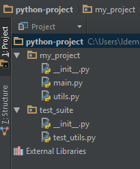
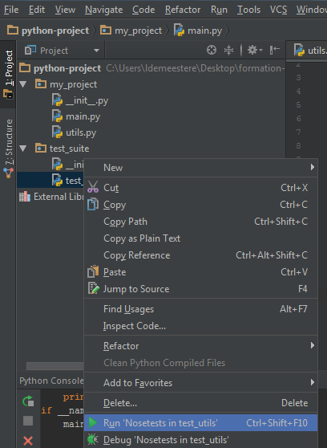

# Industrialization of a Python project

## Creating a package in Python

For a large number of Python classes or modules, it is often necessary to organize them into packages. Indeed, when the number of modules (a module might be just a file containing some classes) in any project grows significantly, it is wiser to organize them into packages, which actually means placing functionally similar modules/classes in the same directory.

#### Steps to Create a Python Package

Working with Python packages is really simple. All you need to do are these following steps :

- Create a directory and give it your package's name
- Put your modules inside (it can be several Python scripts)
- Create a `__init__.py` file in the directory

The `__init__.py` file is necessary because with this file, Python will know that this directory is a Python package directory and not an ordinary directory. This `__init__.py` file can stay empty.

## Exercise 4.2.1 : Create a Python Package

First, create a new directory named *python-project* in which you could do these different steps :

**1) Create a package directory :** create a directory named *my_project*

**2) Add modules :**

- a Python file named `utils.py` with the following code :

```python
def my_sum(x, y):
    return x + y
```

- a Python file named `main.py` with the following code :

```python
import my_project.utils as utils


def main(arg1, arg2):
    result = utils.my_sum(arg1, arg2)
    print('The result is ' + str(result))

if __name__ == '__main__':
    main(1, 2)
```

**3) Test your package :** you can test that your Python package is ok or not by running the *main.py* script (with Pycharm, the Python console or with a command line)

What is missing to make your code running ?

**4) Add the**`__init__.py`**file :** create an empty file named `__init__.py` inside

**5) Test again your package :** you can test that your Python package is now ok by running the code from the question 3


## Unit tests with Python

Testing your code is very important, for you as for them who could work on your code. Here are some general rules about testing :

- A unit test should focus on one functionality and prove that it is correct

- Each unit test must be fully independent : each test must be loaded with a new dataset and may have to do some cleanup afterwards, which is usually handled by `setUp()` and `tearDown()` methods

- Try to make tests that run fast (if some tests are slow, they can be subject of another test suite which can be deployed separetly)

- Always run the full test suite before a coding session, and run it again after, this will give you more confidence that you did not break anything in the rest of the code

- The first step when you are debugging your code is to write a new test reproducing the bug

- Use long and descriptive names for testing functions (e.g. `test_square_negative_number()`), because these function names are displayed when a test fails, and should be as descriptive as possible

- These unit tests can be regarded as some code documentation because it tests different use cases according to an expected result, so they can largely help developers that has to work on the code of someone else

- Ideally one should take the habit of developing the tests even before developing the function to be tested


#### Unittest

`unittest` is the batteries-included test module in the Python standard library. Creating test cases is accomplished by subclassing `unittest.TestCase`.

Here is an example of a unit test :

```python
import unittest

def my_sum(x, y):
    return x + y

class MyTest(unittest.TestCase):
    def test_my_sum_for_negative_numbers(self):
        self.assertEqual(my_sum(-5, -1), -6)
```

The `unittest.TestCase` class provides several assert methods to check for and report failures. The following table lists the most commonly used methods :

| Method | Checks that |
|--------|--------|
| assertEqual(a, b) | a == b |
| assertNotEqual(a, b) | a != b |
| assertTrue(x) | bool(x) |
| assertFalse(x) | bool(x) |
| assertIs(a, b) | a is b |
| assertIsNot(a, b) | a is not b |
| assertIsNone(x) | x is None |
| assertIsNotNone(x) | x is not None |
| assertIn(a, b) | a in b |
| assertNotIn(a, b) | a not in b |
| assertIsInstance(a, b) | isinstance(a, b) |
| assertNotIsInstance(a, b) | not isinstance(a, b) |


#### SetUp and TearDown

The `setUp()` and `tearDown()` methods allow you to define instructions that will be executed before and after each test method.

Note that if the `setUp()` function succeeded, the `tearDown()` method will be run whether the function to test succeeded or not.

Example :

```python
import unittest

def my_sum(x, y):
    return x + y

class MyTest(unittest.TestCase):
	def setUp():
    	self.initial_value = sum([-5, -1])

    def tearDown():
    	print('Cleaning !')

    def test_my_sum_for_negative_numbers(self):
        self.assertEqual(my_sum(-5, -1), self.initial_value)
```


## Exercise 4.2.2 : Creating and running a unit test

**1) Create a test directory :** in your *python-project* directory, create a directory named *test_suite*

**2) Add the **`__init__.py`** file :** create an empty file named `__init__.py` inside

**3) Create a file for testing your **`utils.py`** module : ** create a `test_utils.py` module in your test directory, in such a way as to obtain this structure :



**4) Run your test with Pycharm :** right-click on the `test_utils.py` file and run the tests :



*N.B. : Nosetests is an extension of unittest*

You should obtain this result :


*N.B. : Note that the 'Toggle auto-test' button allows to rerun the tests on code changes, you can test it !*

**5) Create a new test :**

- Modify your `my_sum()` function to manage having some input parameters which are not numbers (by catching them with an *if/else* block)

- Then create a new test to check how this function reacts with no numbers input parameters (e.g. string parameters)


## Python code documentation : using docstrings

The common practice of documenting a code object at the head of its definition is captured by the addition of docstring syntax in the Python language.

The docstring for a Python code object (a module, class or function) is the first statement of that code object, immediately following the definition (the 'def' or 'class' statement). The docstring for the code object is available on that code object's '__doc__' attribute.

Pycharm allows you to easily generate the docstrings of your functions. 

Example :

```python
def my_sum(x, y):
    """
    Gives the result of the sum of the 2 input parameters

    :param x: integer to sum
    :param y: integer to sum
    :return: sum of the 2 input parameters
    """
    return x + y
```

And to get the docstring specific to a function :

```python
print(my_sum.__doc__)
```

which returns :

```
Gives the result of the sum of the 2 input parameters
:param x: integer to sum
:param y: integer to sum
:return: sum of the 2 input parameters
```


## Virtual environments

#### virtualenv

`virtualenv` is a tool to create isolated Python environments. `virtualenv` creates a folder which contains all the necessary executables to use the packages that a Python project would need.

Install `virtualenv` via pip :

```bash
sudo pip install virtualenv
```

You can test your installation by :

```bash
virtualenv --version
```

#### How using it ?

You can easily create a virtual environment for a project by :

```bash
cd my_project_directory
virtualenv -p python3 venv
```

`virtualenv venv` will create a directory in the current one which will contain the Python executable files, and a copy of the `pip` library which you can use to install other packages. In the example above, `venv` is the name of the virtual environment.

Then, for using this virtual environment, it needs to be activated :

```bash
source venv/bin/activate
```

The name of the current virtual environment will now appear on the left of the prompt (e.g. `(venv)Your-Computer:your_project UserName$`) to let you know that it's active. From now on, any package that you install using `pip` will be placed in the `venv` folder, isolated from the global Python installation.

You can install packages as usual, for example :

```bash
pip install my_package
```

In order to keep your environment consistent, it's a good idea to "freeze" the current state of the environment packages. To do this, run :

```bash
pip freeze > requirements.txt
```

This will create a `requirements.txt` file, which contains a simple list of all the packages in the current environment, and their respective versions. You can see the list of installed packages without the requirements format using `pip list`. Later it will be easier for a different developer (or you, if you need to re-create the environment) to install the same packages using the same versions :

```bash
pip install -r requirements.txt
```

To deactivate your virtual environment, simply do :

```bash
deactivate
```

To delete a virtual environment, just delete its folder.

## To go further

#### Python Eggs

"Eggs are to Pythons as Jars are to Java..."

The Python Eggs are a way of distributing Python packages. There is an easy method of installing them, using `easy_install` :

```bash
easy_install somepackage.egg
```

A great feature is also that Eggs can define dependencies on other packages which `easy_install` will then try to automatically download and install as well.

To read about creating a Python Egg, follow this link : http://peak.telecommunity.com/DevCenter/PythonEggs.

#### PEX files

Files with the .pex extension - "PEX files" or ".pex files" – are self-contained executable Python virtual environments. PEX files make it easy to deploy Python applications.

A good video about .PEX : [WTF is PEX?](https://www.youtube.com/watch?v=NmpnGhRwsu0)
